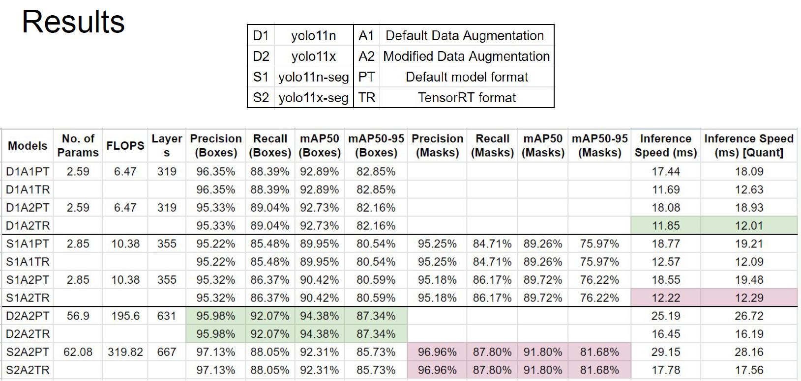

# Real-Time Grocery Item Detection and Segmentation System

This repository showcases a robust system for real-time detection and segmentation of common grocery items using YOLO (You Only Look Once) models. The project was built to explore efficient deep learning solutions for object recognition and instance segmentation tasks and demonstrates proficiency in model training, optimization, and deployment.

## Project Overview

This project leverages cutting-edge deep learning techniques to build a fast and accurate system for identifying and segmenting a variety of grocery items. The primary goals were to:

*   Develop and train multiple YOLO-based models for both object detection and instance segmentation.
*   Optimize model performance for real-time processing, focusing on inference speed and accuracy.
*   Create a user-friendly Gradio application for live demonstration and interaction.
*   Export models to TensorRT format for improved inference performance on NVIDIA hardware.

## Project Demo


https://github.com/user-attachments/assets/ee25f2c5-7e67-4556-b975-56078a9d6237


## Key Features

*   **Multi-Model Training**: Includes scripts to train various YOLO architectures, specifically `YOLOv11n` and `YOLOv11x`, for detection and segmentation.
*   **Real-Time Demo**: A Gradio-based web application allows users to upload images or use a webcam to see live detection and segmentation results.
*   **Model Optimization**: Includes TensorRT exporting for faster inference speeds, crucial for real-time applications.
*   **Comprehensive Metrics Evaluation**: Scripts to compute performance metrics such as precision, recall, mAP (mean Average Precision), and inference speed.
*   **Modular Design**: The project is structured with modular Python scripts to facilitate training, evaluation, and deployment of the models.

## Project Structure

This repository is organized as follows:

*   `main.py`: Launches a Gradio web application for real-time object detection and segmentation demonstrations.
*   `batch_train.py`: Trains multiple YOLO object detection and segmentation models using a custom grocery item dataset.
*   `batch_metrics.py`: Evaluates model performance using metrics like precision, recall, mAP, and inference speed, both with and without model quantization.
*  `batch_export.py`: Exports trained models to TensorRT format for improved runtime performance on compatible hardware.
*  `data_preprocessing.ipynb`: Jupyter notebook for data preparation, and annotation format conversion (COCO to YOLO).

## Getting Started

1.  **Prepare Your Dataset:** Follow the steps in `data_preprocessing.ipynb` to organize and prepare your grocery item images and annotations. The notebook also details the conversion from the COCO format to the YOLO format, which is required for training.

2.  **Install Dependencies:** Install the required packages using pip:

    ```bash
    pip install ultralytics gradio opencv-python tensorrt
    ```

3.  **Run the Gradio Application:** Launch the web interface to demonstrate the real-time capabilities of the models.

    ```python
    python main.py
    ```

4.  **Train Models:** Use this script to train multiple models with different parameters.
    ```python
    python batch_train.py
    ```

5.  **Evaluate Performance:** Collect and display model performance metrics for different training and export parameters:
    ```python
    python batch_metrics.py
    ```

6. **Export Models:** Optimize for GPU performance:
    ```python
    python batch_export.py
    ```
    
## Results

The project demonstrates competitive results in both detection and segmentation accuracy across multiple architectures. Detailed performance metrics, as captured by `batch_metrics.py`, will show the trade-offs between speed and accuracy across different models. The performance benefits are especially noticeable when models are exported to TensorRT format for optimized deployment on compatible NVIDIA GPUs.



## Technologies Used

*   **YOLOv11**: A state-of-the-art object detection and segmentation model.
*   **PyTorch**: The deep learning framework used for model training.
*   **TensorRT**: NVIDIA's high-performance deep learning inference SDK for optimizing model performance.
*   **Gradio**: A Python library for creating user-friendly web applications for demonstrating machine learning models.
*   **OpenCV**: Used for image processing and video handling.

## Future Enhancements

*   Integration with a cloud platform for wider accessibility.
*   Further optimization for lower-powered hardware.
*   Expanding the range of grocery items detected and segmented.
*   Implementing model quantization to further increase inference speed.

## Conclusion

This project provides a comprehensive end-to-end solution for real-time grocery item detection and segmentation, highlighting both model training and deployment. The project demonstrates expertise in deep learning, model optimization, and application development. The combination of a user-friendly Gradio web interface, high performance via TensorRT exports, and detailed metrics evaluation provide a well-rounded example of a real-world deep learning system.
